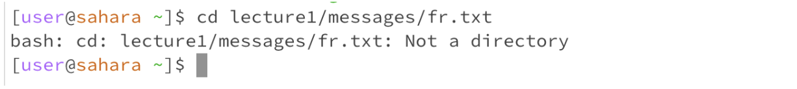
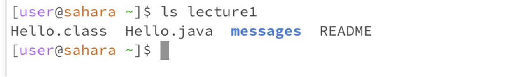
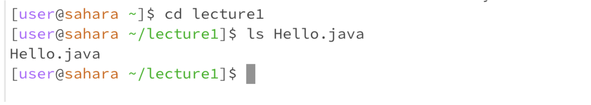
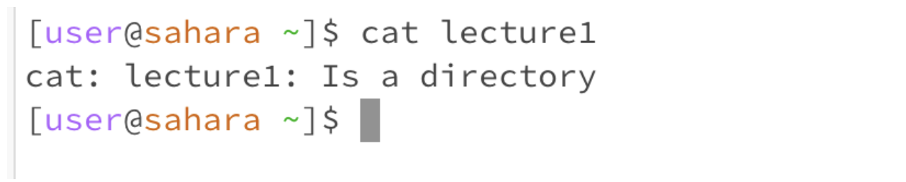
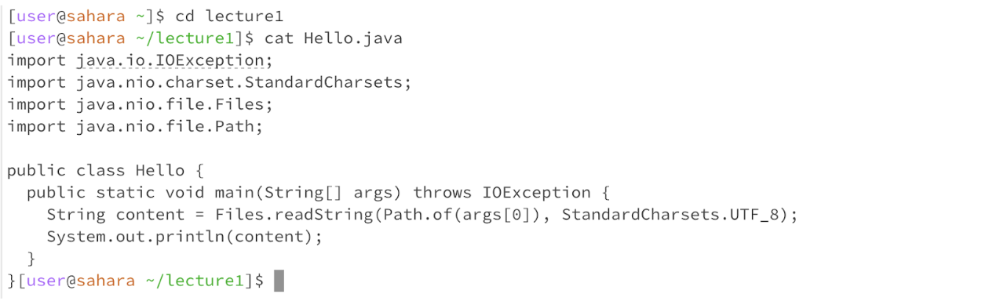

# Lab Report 1

Shenova Davis  
CSE 15L

## 1. `cd`
   
a. Share an example of using the command with no arguments.
 

The working directory was initially the home directory and when I ran the command it remained in the same directory. I got this output because I wanted to change the directory but did not specify the directory that I wanted to go into. As a result, nothing changed and I remained in the home directory. The output was not an error.

b. Share an example of using the command with a path to a directory as an argument.

The working directory was initially the home directory. When I ran the command the working directory changed to `lecture1` because I used the `cd` command to work in the `lecture1` directory. I got this output because the directory had changed from the home directory to the `lecture1` directory. The output now shows that I am in the `lecture1` directory with the “~/lecture1”. This output was not an error.

c. Share an example of using the command with a path to a file as an argument.

The working directory initially was the home directory. I then tried to change the directory to the `lecture1` directory, then the messages directory, and then to the text file `fr.txt`. I got this output because the `cd` command runs to change the directory that we are in. When I tried to `cd` into a file, it produced an error and printed that the file was not a directory.

## 2. `ls`

a. Share an example of using the command with no arguments.
 

The working directory that I was in when I ran the command was the home directory. I got this output because the `ls` command will list the contents of the directory we are working in. For this example, the `lecture1` file is in the home directory. This output is not an error.

b. Share an example of using the command with a path to a directory as an argument.
 

The working directory that we are in is the home directory. When I ran the `ls` command with another directory `lecture1`, the output showed the contents that are in the file. This is because the `ls` command will list the contents of the directory and we had specified the directory to be `lecture1`, therefore it outputted a list of the contents of that file.  

c. Share an example of using the command with a path to a file as an argument.

The working directory that I was in was the home directory and then I used the `cd` command to go into the `lecture1` directory. Then I ran the `ls` command on the `Hello.java` file and the output was the title of the file. This result is an error because the `ls` command is used to list the contents of a directory, and therefore cannot be used on a file. 

## 3. cat

a. Share an example of using the command with no arguments.
 

The working directory that I was in is the home directory. I used the `cat` command with no arguments and the result was the command line was waiting for user input. I then typed the phrase “Hello World!” and the command line printed the statement. With the `cat` command anything that was inputted by the user would be printed. To exit this I used `ctrl c` on my keyboard. This result was not an error. 

b. Share an example of using the command with a path to a directory as an argument.
 

The directory I was in was the home directory. I used the `cat` command on the `lecture1` directory and the output showed that `lecture1` is a directory. This is an error because the `cat` command is used to display the contents of a file and since `lecture1` is a directory, the command line showed an error. 

c. Share an example of using the command with a path to a file as an argument.

The directory I was in when I ran this command was the `lecture1` directory. I ran the `cat` command on the `Hello.java` file. The output displayed what was in the file, in this case, it was the Java code. This was not an error as this is what the cat command is meant for since it displayed the contents of the file. 
