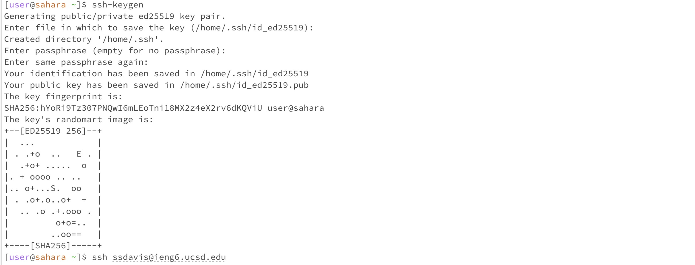
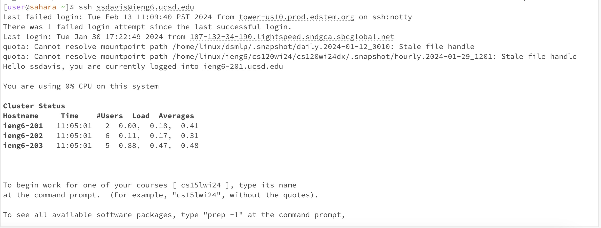

# Lab Report 2

Shenova Davis  
CSE 15L

## Part 1

```
import java.io.IOException;
import java.net.URI;

class Handler implements URLHandler {

    String newChat = "";
    
    public String handleRequest(URI url) {
        if (url.getPath().contains("/add-message")) {
            String[] parameters = url.getQuery().split("&");

            String chatString = " ";
            String userString = " ";

            for(String param : parameters){
                String[] SingleParameter = param.split("=");
                if (SingleParameter[0].equals("s")) {
                    chatString = chatString + SingleParameter[1] ;
                } 
                else if (SingleParameter[0].equals("user")) {
                    userString = userString + SingleParameter[1];
                }
            }
            
            String newMessage = userString + ": " + chatString + "\n";
            newChat = newChat + newMessage;
            return newChat;
        }
        return "404 Not Found!";
    }
}

class ChatServer {
    public static void main(String[] args) throws IOException {
        if(args.length == 0){
            System.out.println("Missing port number! Try any number between 1024 to 49151");
            return;
        }

        int port = Integer.parseInt(args[0]);

        Server.start(port, new Handler());
    }
}
```


1. The method that is called when this code is run is the `handleRequest` method, which understands the URL input and prints out the message for the chat. Then the `url.getPath().contains` method checks if the URL has the message "/add-message" to run the messages. The `.split()` method will split the input at the "&" and create two separate arguments, one that contains the message and one that contains the user. There is also a `.equals()` method that checks for the input whether it is "s" or "user" through the if statements. The `main` method is also called to start the server and 
2. The argument for the `handleRequest` method is the `URI url` which reads the input from the URL on the server. The `url.getPath().contains` takes in a string argument that the method will look for. In this example, the method checks for the "/add-message" in the URL input. The `.split()` method takes in a string argument to create two string parameters at the specified string. The `.equals()` method takes in a string input to compare to the first variable to see if they equal each other. One relevant field in the class is the `newChat` string which gets updated with the message when the `/add-message` input is in the URL. The 'newChat' variable is a relevant field of the class `Handler`, which will store the chat history. Currently `newChat` is empty. After we call the `handleRequest` method, `newChat will contain the `string` "hello world". 
3. The value `newChat` gets changed based on the message the user specified in the URL. As the chats appear, the `newChat` string gets updated to display the chat. This allows the chat to be preserved and displayed even when there is another message being added. In this example, the `newChat` variable gets updated with the message "shenova: hello world".


1. The method that is called when this code runs is also the `handleRequest` method, which takes in the input from the URL and runs through the if statements to output the message. This method utilizes the `.contains()` and `.split()` methods to check if the URL contains an "s" or "user" and splits the URL into two parameters. The `.split()` method will also split the url input at the "&" sign to read in the "s=" parameter and "message=" parameter as two separate strings. 
2. The argument for the `handleRequest` method is the `URI url` which will read the input from the URL for the server. The `.split()` and `.contains() methods take in a string input to parse through the input and look for the argument. The `newChat` class field currently has the `string` "shenova: hello world" from the previous method call. 
3. The values from these methods changed the `newChat` string which displays the chat on the server. Initially, `newChat` contained the string "shenova: hello world". After the second method call for, `newChat` gets updated to also hold the new user input "computer: hello shenova".


## Part 2

 Private key: /home/.ssh/id_ed25519
 Public key: /home/.ssh/id_ed25519. pub



This screenshot shows the login with no password required.


## Part 3
From weeks 2 and 3, I learned how to properly use command line commands to access different files and directories. I had vaguely heard of these commands before and used them, but I was able to get clarity on what each command was to be used for. Additionally, I learned how to access a remote server and understood how to use the remote server, for example using SSH and accessing my school account. I also thought using the server to access and manipulate a webpage was very interesting and I had fun trying the different commands and methods. 
