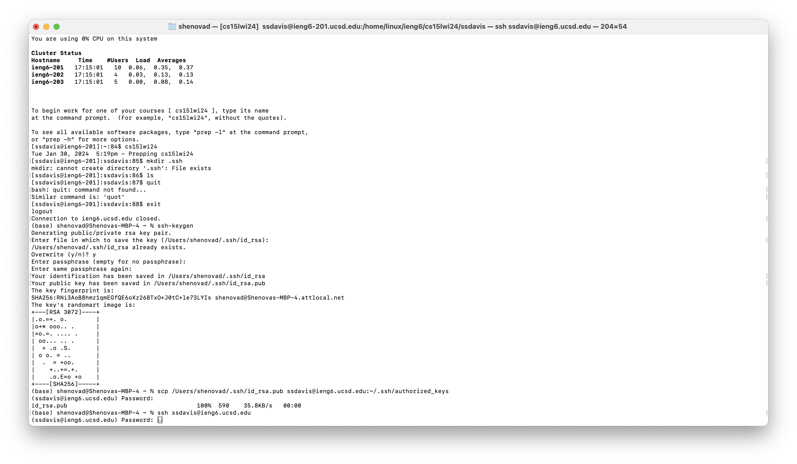

# Lab Report 2

Shenova Davis  
CSE 15L

## Part 1

```
class Handler implements URLHandler {

    String newChat = "";
    
    public String handleRequest(URI url) {
        if (url.getPath().contains("/add-message")) {
            String[] parameters = url.getQuery().split("&");

        String chatString = " ";
        String userString = " ";

            for(String param : parameters){
                String[] SingleParameter = param.split("=");
                    if (SingleParameter[0].equals("s")) {
                    chatString = chatString + SingleParameter[1] ;
                    }
                    else if (SingleParameter[0].equals("user")) {
                    userString = userString + SingleParameter[1];
                    }
            }
            String newMessage = userString + ": " + chatString + "\n";
            newChat = newChat + newMessage;
            return newChat;
        }
        return "404 Not Found!";
    }
}
```


1. The methods that are called when this code is run is the handleRequest method, which understands the URL input and prints out the message for the chat. Then the url.getPath().contains method checks if the URL has the message "/add-message" to run the messages. The .split method will create split the input at the "&" and create two separate arguments, one that contains the message and one that contains the user. There is also a .equals() method that checks for the input whether it is "s" or "user" through the if statements.
2. The arguments for these methods are chatString and userString. These values get updated based on the user input in the URL.
3. The values get changed based on the message and the user specified in the URL. As the chats appear, the newChat string gets updated to display the chat. This allows the chat to be preserved and displayed even when there is another message being added. 


1. The methods that are called when this code runs is also the handleRequest method, which takes in the input from the URL and runs through the if statements to output the message. This method utilizes the .contains and .split methods to check if the URL contains an "s" or "user" and splits the URL into two parameters.
2. The arguments for these methods is the chatString and userString as they both get updated depending on the URL input.
3. The values from these methods changed the newChat string which displays the chat on the server. In the second message, newChat already had the string input from the first user's input.


## Part 2

I tried creating an SSH key in lab and was not able to do it even with the help of TAs. I tried it again and am facing the same issue. I have attached a screenshot of my work and was told by the TAs to submit the terminal and explain why it was not working. 


## Part 3
From weeks 2 and 3, I learned how to properly use command line commands to access different files and directories. I had vaguely heard of these commands before and used them, but I was able to get clarity on what each command was to be used for. Additionally, I learned how to access a remote server and understood how to use the remote server, for example using SSH and accessing my school account. I also thought using the server to access and manipulate a webpage was very interesting and I had fun trying the different commands and methods. 
