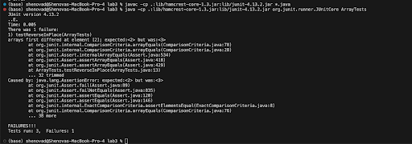

# Lab Report 3

Shenova Davis  
CSE 15L

## Part 1 - Bugs

A failure-inducing input for the buggy program:
   
```
public class ArrayTests {
 @Test
 public void testReverseInPlace() {
   int[] input2 = {1,2,3,4};
   ArrayExamples.reverseInPlace(input2);
   assertArrayEquals(new int[]{4,3,2,1}, input2);
```
An input that doesn't induce a failure.

```
public class ArrayTests {
 @Test
 public void testReverseInPlace() {
   int[] input1 = { 3 };
   ArrayExamples.reverseInPlace(input1);
   assertArrayEquals(new int[]{ 3 }, input1);
```

The symptom:


The bug:

Before:
```
static void reverseInPlace(int[] arr) {
   for(int i = 0; i < arr.length; i += 1) {
     arr[i] = arr[arr.length - i - 1];
   }
 }
```

After: 
```
 static void reverseInPlace(int[] arr) {
   for(int i = 0; i < arr.length / 2; i += 1) {
     int temp = arr[i];
     arr[i] = arr[arr.length - i - 1];
     arr[arr.length - i - 1] = temp;
   }
 }
```

In the original code, the method was overwriting the elements in the array and the original elements were not being preserved. With the changes, we assign the array element temporarily in the variable `temp`, then set the index to be the other index at the element of the `arr.length - index[i] - 1` to properly reverse the list. Finally, it sets that index with the temporary placeholder variable to execute the reverse list. 


## Part 2 - Researching Commands

### `-find` Command:

#### `find -type`

Example 1:
```
[user@sahara ~/docsearch]$ find ~ -type d
/home
/home/docsearch
/home/docsearch/.git
/home/docsearch/.git/objects
/home/docsearch/.git/objects/info
/home/docsearch/.git/objects/pack
/home/docsearch/.git/refs
/home/docsearch/.git/refs/heads
/home/docsearch/.git/refs/remotes
/home/docsearch/.git/refs/remotes/origin
/home/docsearch/.git/refs/tags
/home/docsearch/.git/logs
/home/docsearch/.git/logs/refs
/home/docsearch/.git/logs/refs/heads
/home/docsearch/.git/logs/refs/remotes
/home/docsearch/.git/logs/refs/remotes/origin
/home/docsearch/.git/info
/home/docsearch/.git/hooks
/home/docsearch/.git/branches
/home/docsearch/lib
/home/docsearch/technical
/home/docsearch/technical/biomed
/home/docsearch/technical/911report
[user@sahara ~/docsearch]$
```

Example 2:
```
[user@sahara ~/docsearch]$ find ~ -type f -name "*.sample"
/home/docsearch/.git/hooks/pre-receive.sample
/home/docsearch/.git/hooks/pre-commit.sample
/home/docsearch/.git/hooks/pre-merge-commit.sample
/home/docsearch/.git/hooks/sendemail-validate.sample
/home/docsearch/.git/hooks/post-update.sample
/home/docsearch/.git/hooks/update.sample
/home/docsearch/.git/hooks/pre-push.sample
/home/docsearch/.git/hooks/commit-msg.sample
/home/docsearch/.git/hooks/applypatch-msg.sample
/home/docsearch/.git/hooks/pre-applypatch.sample
/home/docsearch/.git/hooks/prepare-commit-msg.sample
/home/docsearch/.git/hooks/fsmonitor-watchman.sample
/home/docsearch/.git/hooks/pre-rebase.sample
/home/docsearch/.git/hooks/push-to-checkout.sample
```

The `find` command paired with `-type` allows us to find an element of a certain type in our directory. `-type d` outputs all of the directories that are found in the file. Similarily `find ~ -type f -name ".*sample"` outputs all of the files that are `.sample` types. This command can be useful in understanding what kinds of files and directories are in our working directory to understand its contents and uses. 

Sources used:
- <https://www.geeksforgeeks.org/find-command-in-linux-with-examples/>
- <https://linuxhandbook.com/find-command-examples/>
- <https://www.redhat.com/sysadmin/linux-find-command>

#### `find -name`

Example 1:
```
[user@sahara ~/docsearch]$ find . -name ".*"
.
./.git
```

Example 2:
```
[user@sahara ~/docsearch]$ find -name "*.sample" -mtime -1
./.git/hooks/pre-receive.sample
./.git/hooks/pre-commit.sample
./.git/hooks/pre-merge-commit.sample
./.git/hooks/sendemail-validate.sample
./.git/hooks/post-update.sample
./.git/hooks/update.sample
./.git/hooks/pre-push.sample
./.git/hooks/commit-msg.sample
./.git/hooks/applypatch-msg.sample
./.git/hooks/pre-applypatch.sample
./.git/hooks/prepare-commit-msg.sample
./.git/hooks/fsmonitor-watchman.sample
./.git/hooks/pre-rebase.sample
./.git/hooks/push-to-checkout.sample
```

The `find -name` command allows us to find certain files and directories by name or specification. In the first example, I did `find . -name ".*"` to look for the hidden files in `docsearch`. In the second example, I searched for `.sample` files that have been modified in the last day. The `find -name` command can be useful to find specific files or directories in our working directory and can aid in simplifying our search. 

Sources used:
- <https://www.geeksforgeeks.org/find-command-in-linux-with-examples/>
- <https://www.redhat.com/sysadmin/linux-find-command>
- <https://www.tutorialspoint.com/working-with-hidden-files-in-linux#:~:text=Find%20Hidden%20Files%20Using%20Find%20Command&text=To%20find%20hidden%20files%20using,that%20starts%20with%20a%20dot.>

#### `find -empty`

Example 1:
```
[user@sahara ~/docsearch]$ find ~ -type f -empty
/home/docsearch/technical/biomed/bcr303.txt
/home/docsearch/technical/biomed/1476-4598-2-2.txt
/home/docsearch/technical/biomed/1477-7827-1-23.txt
/home/docsearch/technical/biomed/ar79.txt
/home/docsearch/technical/biomed/1476-4598-1-5.txt
/home/docsearch/technical/biomed/bcr317.txt
/home/docsearch/technical/biomed/1477-7827-1-36.txt
/home/docsearch/technical/biomed/1477-7525-1-12.txt
/home/docsearch/technical/biomed/1476-9433-1-2.txt
/home/docsearch/technical/biomed/bcr294.txt
/home/docsearch/technical/biomed/ar750.txt
/home/docsearch/technical/biomed/1476-0711-2-3.txt
/home/docsearch/technical/biomed/bcr273.txt
/home/docsearch/technical/biomed/1476-4598-2-20.txt
/home/docsearch/technical/biomed/1477-7827-1-46.txt
/home/docsearch/technical/biomed/ar383.txt
/home/docsearch/technical/biomed/1476-069X-2-9.txt
/home/docsearch/technical/biomed/1478-1336-1-4.txt
/home/docsearch/technical/biomed/1475-925X-2-6.txt
/home/docsearch/technical/biomed/1477-7827-1-17.txt
/home/docsearch/technical/biomed/bcr631.txt
/home/docsearch/technical/biomed/ar799.txt
/home/docsearch/technical/biomed/1476-4598-1-3.txt
/home/docsearch/technical/biomed/bcr570.txt
/home/docsearch/technical/biomed/1477-7827-1-6.txt
/home/docsearch/technical/biomed/bcr602.txt
/home/docsearch/technical/biomed/1476-4598-2-25.txt
/home/docsearch/technical/biomed/1476-4598-2-22.txt
/home/docsearch/technical/biomed/bcr567.txt
/home/docsearch/technical/biomed/1476-511X-1-2.txt
/home/docsearch/technical/biomed/ar408.txt
/home/docsearch/technical/biomed/bcr45.txt
/home/docsearch/technical/biomed/1476-4598-2-28.txt
/home/docsearch/technical/biomed/1476-9433-1-3.txt
/home/docsearch/technical/biomed/1475-9268-1-2.txt
/home/docsearch/technical/biomed/bcr284.txt
/home/docsearch/technical/biomed/1475-925X-2-3.txt
/home/docsearch/technical/biomed/1476-511X-2-3.txt
/home/docsearch/technical/biomed/ar624.txt
/home/docsearch/technical/biomed/ar120.txt
/home/docsearch/technical/biomed/1476-4598-1-6.txt
/home/docsearch/technical/biomed/1476-069X-2-2.txt
/home/docsearch/technical/biomed/bcr568.txt
/home/docsearch/technical/biomed/ar319.txt
/home/docsearch/technical/biomed/1478-7954-1-3.txt
/home/docsearch/technical/biomed/bcr458.txt
/home/docsearch/technical/biomed/ar615.txt
/home/docsearch/technical/biomed/1475-925X-2-12.txt
/home/docsearch/technical/biomed/bcr583.txt
/home/docsearch/technical/biomed/1475-925X-2-10.txt
/home/docsearch/technical/biomed/ar104.txt
/home/docsearch/technical/biomed/1476-511X-2-2.txt
/home/docsearch/technical/biomed/1477-7827-1-48.txt
/home/docsearch/technical/biomed/ar774.txt
/home/docsearch/technical/biomed/1476-069X-2-7.txt
/home/docsearch/technical/biomed/1475-9276-1-3.txt
/home/docsearch/technical/biomed/bcr618.txt
/home/docsearch/technical/biomed/ar745.txt
/home/docsearch/technical/biomed/ar601.txt
/home/docsearch/technical/biomed/ar140.txt
/home/docsearch/technical/biomed/1477-7827-1-31.txt
/home/docsearch/technical/biomed/ar331.txt
/home/docsearch/technical/biomed/1476-069X-2-4.txt
/home/docsearch/technical/biomed/ar130.txt
/home/docsearch/technical/biomed/ar430.txt
/home/docsearch/technical/biomed/bcr607.txt
/home/docsearch/technical/biomed/ar778.txt
/home/docsearch/technical/biomed/1477-7819-1-10.txt
/home/docsearch/technical/biomed/1477-5956-1-1.txt
/home/docsearch/technical/biomed/ar118.txt
/home/docsearch/technical/biomed/1477-7525-1-9.txt
/home/docsearch/technical/biomed/ar407.txt
/home/docsearch/technical/biomed/1475-925X-2-1.txt
/home/docsearch/technical/biomed/ar792.txt
/home/docsearch/technical/biomed/1475-9268-1-1.txt
/home/docsearch/technical/biomed/1477-7827-1-21.txt
/home/docsearch/technical/biomed/ar619.txt
/home/docsearch/technical/biomed/bcr635.txt
/home/docsearch/technical/biomed/1476-069X-1-3.txt
/home/docsearch/technical/biomed/1477-7827-1-54.txt
/home/docsearch/technical/biomed/ar321.txt
/home/docsearch/technical/biomed/bcr605.txt
/home/docsearch/technical/biomed/1478-1336-1-3.txt
/home/docsearch/technical/biomed/ar422.txt
/home/docsearch/technical/biomed/ar93.txt
/home/docsearch/technical/biomed/ar387.txt
/home/docsearch/technical/biomed/ar612.txt
/home/docsearch/technical/biomed/ar297.txt
/home/docsearch/technical/biomed/1475-925X-2-11.txt
/home/docsearch/technical/biomed/ar149.txt
/home/docsearch/technical/biomed/1478-1336-1-2.txt
/home/docsearch/technical/biomed/1477-7827-1-9.txt
/home/docsearch/technical/biomed/ar328.txt
/home/docsearch/technical/biomed/1476-4598-2-3.txt
/home/docsearch/technical/biomed/1476-4598-2-1.txt
/home/docsearch/technical/biomed/1476-5918-1-2.txt
/home/docsearch/technical/biomed/1476-4598-2-24.txt
/home/docsearch/technical/biomed/1476-072X-2-3.txt
/home/docsearch/technical/biomed/1477-7827-1-27.txt
/home/docsearch/technical/biomed/1476-4598-1-8.txt
/home/docsearch/technical/biomed/bcr588.txt
/home/docsearch/technical/biomed/ar429.txt
/home/docsearch/technical/biomed/ar409.txt
/home/docsearch/technical/biomed/ar795.txt
/home/docsearch/technical/biomed/ar68.txt
/home/docsearch/technical/biomed/1476-0711-2-7.txt
/home/docsearch/technical/biomed/bcr620.txt
/home/docsearch/technical/biomed/bcr285.txt
/home/docsearch/technical/biomed/ar309.txt
/home/docsearch/technical/biomed/1477-7827-1-13.txt
/home/docsearch/technical/biomed/1477-7827-1-43.txt
/home/docsearch/technical/biomed/1476-072X-2-4.txt
/home/docsearch/technical/biomed/bcr571.txt
/home/docsearch/technical/biomed/1477-7525-1-10.txt
```
Example 2:
```
[user@sahara ~/docsearch]$ find ~ -type d -empty
/home/docsearch/.git/objects/info
/home/docsearch/.git/refs/tags
/home/docsearch/.git/branches
```

The `find -empty` command allows us to find files or directories that are empty. In the first example, I searched for all the files that were empty using `find ~ -type f -empty`, where the output displayed all the files that were empty with no contents. In the next example, I searched for directories that are empty using `find ~ -type d -empty`. This displayed the paths for the directories that do not contain any files. This command can be useful for us to see the contents of our files and directories, which can help us understand our working directory better.

Sources used:
- <https://www.geeksforgeeks.org/find-command-in-linux-with-examples/>
- <https://www.redhat.com/sysadmin/linux-find-command>

#### `find -size`

Example 1:
```
[user@sahara ~/docsearch]$ find -type f -size -1k
./technical/biomed/bcr303.txt
./technical/biomed/1476-4598-2-2.txt
./technical/biomed/1477-7827-1-23.txt
./technical/biomed/ar79.txt
./technical/biomed/1476-4598-1-5.txt
./technical/biomed/bcr317.txt
./technical/biomed/1477-7827-1-36.txt
./technical/biomed/1477-7525-1-12.txt
./technical/biomed/1476-9433-1-2.txt
./technical/biomed/bcr294.txt
./technical/biomed/ar750.txt
./technical/biomed/1476-0711-2-3.txt
./technical/biomed/bcr273.txt
./technical/biomed/1476-4598-2-20.txt
./technical/biomed/1477-7827-1-46.txt
./technical/biomed/ar383.txt
./technical/biomed/1476-069X-2-9.txt
./technical/biomed/1478-1336-1-4.txt
./technical/biomed/1475-925X-2-6.txt
./technical/biomed/1477-7827-1-17.txt
./technical/biomed/bcr631.txt
./technical/biomed/ar799.txt
./technical/biomed/1476-4598-1-3.txt
./technical/biomed/bcr570.txt
./technical/biomed/1477-7827-1-6.txt
./technical/biomed/bcr602.txt
./technical/biomed/1476-4598-2-25.txt
./technical/biomed/1476-4598-2-22.txt
./technical/biomed/bcr567.txt
./technical/biomed/1476-511X-1-2.txt
./technical/biomed/ar408.txt
./technical/biomed/bcr45.txt
./technical/biomed/1476-4598-2-28.txt
./technical/biomed/1476-9433-1-3.txt
./technical/biomed/1475-9268-1-2.txt
./technical/biomed/bcr284.txt
./technical/biomed/1475-925X-2-3.txt
./technical/biomed/1476-511X-2-3.txt
./technical/biomed/ar624.txt
./technical/biomed/ar120.txt
./technical/biomed/1476-4598-1-6.txt
./technical/biomed/1476-069X-2-2.txt
./technical/biomed/bcr568.txt
./technical/biomed/ar319.txt
./technical/biomed/1478-7954-1-3.txt
./technical/biomed/bcr458.txt
./technical/biomed/ar615.txt
./technical/biomed/1475-925X-2-12.txt
./technical/biomed/bcr583.txt
./technical/biomed/1475-925X-2-10.txt
./technical/biomed/ar104.txt
./technical/biomed/1476-511X-2-2.txt
./technical/biomed/1477-7827-1-48.txt
./technical/biomed/ar774.txt
./technical/biomed/1476-069X-2-7.txt
./technical/biomed/1475-9276-1-3.txt
./technical/biomed/bcr618.txt
./technical/biomed/ar745.txt
./technical/biomed/ar601.txt
./technical/biomed/ar140.txt
./technical/biomed/1477-7827-1-31.txt
./technical/biomed/ar331.txt
./technical/biomed/1476-069X-2-4.txt
./technical/biomed/ar130.txt
./technical/biomed/ar430.txt
./technical/biomed/bcr607.txt
./technical/biomed/ar778.txt
./technical/biomed/1477-7819-1-10.txt
./technical/biomed/1477-5956-1-1.txt
./technical/biomed/ar118.txt
./technical/biomed/1477-7525-1-9.txt
./technical/biomed/ar407.txt
./technical/biomed/1475-925X-2-1.txt
./technical/biomed/ar792.txt
./technical/biomed/1475-9268-1-1.txt
./technical/biomed/1477-7827-1-21.txt
./technical/biomed/ar619.txt
./technical/biomed/bcr635.txt
./technical/biomed/1476-069X-1-3.txt
./technical/biomed/1477-7827-1-54.txt
./technical/biomed/ar321.txt
./technical/biomed/bcr605.txt
./technical/biomed/1478-1336-1-3.txt
./technical/biomed/ar422.txt
./technical/biomed/ar93.txt
./technical/biomed/ar387.txt
./technical/biomed/ar612.txt
./technical/biomed/ar297.txt
./technical/biomed/1475-925X-2-11.txt
./technical/biomed/ar149.txt
./technical/biomed/1478-1336-1-2.txt
./technical/biomed/1477-7827-1-9.txt
./technical/biomed/ar328.txt
./technical/biomed/1476-4598-2-3.txt
./technical/biomed/1476-4598-2-1.txt
./technical/biomed/1476-5918-1-2.txt
./technical/biomed/1476-4598-2-24.txt
./technical/biomed/1476-072X-2-3.txt
./technical/biomed/1477-7827-1-27.txt
./technical/biomed/1476-4598-1-8.txt
./technical/biomed/bcr588.txt
./technical/biomed/ar429.txt
./technical/biomed/ar409.txt
./technical/biomed/ar795.txt
./technical/biomed/ar68.txt
./technical/biomed/1476-0711-2-7.txt
./technical/biomed/bcr620.txt
./technical/biomed/bcr285.txt
./technical/biomed/ar309.txt
./technical/biomed/1477-7827-1-13.txt
./technical/biomed/1477-7827-1-43.txt
./technical/biomed/1476-072X-2-4.txt
./technical/biomed/bcr571.txt
./technical/biomed/1477-7525-1-10.txt
```

Example 2:
```
[user@sahara ~/docsearch]$ find ~ -size +10c -size -100c
/home/docsearch/.git/HEAD
/home/docsearch/.git/refs/heads/main
/home/docsearch/.git/refs/remotes/origin/HEAD
/home/docsearch/.git/description
/home/docsearch/README.md
```
The `find -size` command allows us to find files of a specific size. In the first example, I used the command `find -type f -size -1k` to look for files that are less than 1 kilobyte in size. In the second example, I specified the command using `find ~ -size +10c -size -100c` to specify a range for the size. This command outputted files that are greater than 10 bytes but less than 100 bytes. This command can be useful when looking for specific file sizes that may be needed for our programs. It can also show what files are larger in size, which can take up more capacity in our working directory.

Sources used:
- <https://linuxhandbook.com/find-command-examples/>
- <https://www.geeksforgeeks.org/find-command-in-linux-with-examples/>
