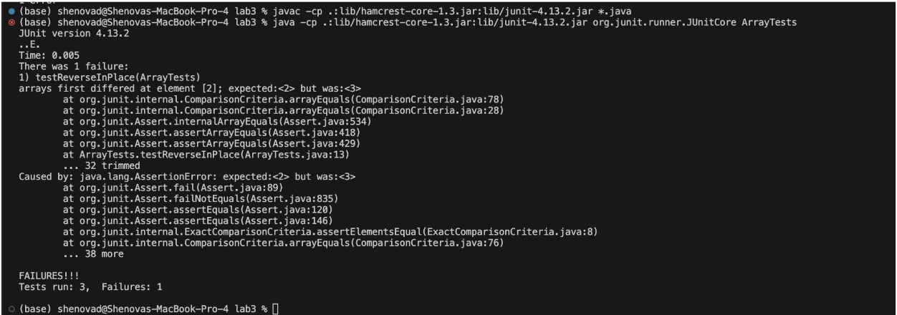

# Lab Report 3

Shenova Davis  
CSE 15L

## Part 1 - Bugs

1. A failure-inducing input for the buggy program:
```
public class ArrayTests {
 @Test
 public void testReverseInPlace() {
   int[] input2 = {1,2,3,4};
   ArrayExamples.reverseInPlace(input2);
   assertArrayEquals(new int[]{4,3,2,1}, input2);
```
2. An input that doesn't induce a failure.

```
public class ArrayTests {
 @Test
 public void testReverseInPlace() {
   int[] input1 = { 3 };
   ArrayExamples.reverseInPlace(input1);
   assertArrayEquals(new int[]{ 3 }, input1);
```

3. The symptom:
   


5. The bug

Before:
```
static void reverseInPlace(int[] arr) {
   for(int i = 0; i < arr.length; i += 1) {
     arr[i] = arr[arr.length - i - 1];
   }
 }
```

After: 
```
 static void reverseInPlace(int[] arr) {
   for(int i = 0; i < arr.length / 2; i += 1) {
     int temp = arr[i];
     arr[i] = arr[arr.length - i - 1];
     arr[arr.length - i - 1] = temp;
   }
 }
```

In the original code, the method was overwriting the elements in the array and the original elements were not being preserved. With the changes, we assign the array element temporarily in the variable temp, then set the index to be the other index at the element of the `arr.length - index[i] - 1` to properly reverse the list. Finally, it sets that index with the temporary placeholder variable to execute the reverse list. 


