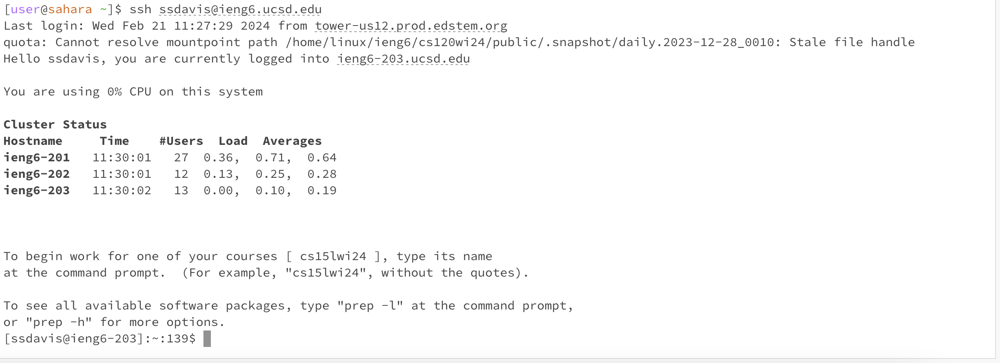
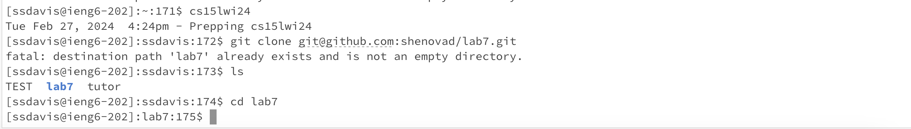
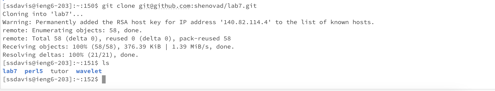
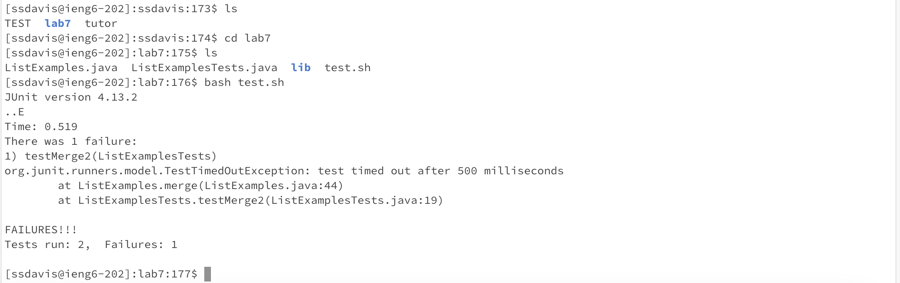
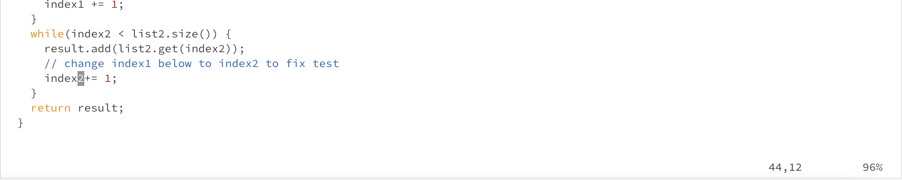
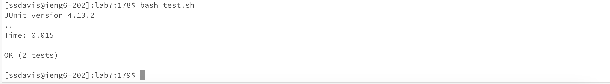
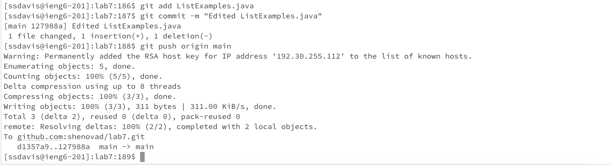

# Lab Report 4

Shenova Davis  
CSE 15L

## Step 4

 

The keys I pressed were `ssh ssdavis@ieng6.ucsd.edu <enter>`. This logged me into my remote server. I then pressed `cs15lwi24<enter>` to go into our course. 

## Step 5

The keys I pressed to clone the repository were `git clone` and then I went into the forked repository, clicked the green button that said "Code" and pressed `command -c` on the SSH link to the repository. I then returned to the terminal and pressed `command -v`. After doing so the command line read `git clone git@github.com:shenovad/lab7.git` and I pressed `<enter>` to clone the repository. 

## Step 6

The keys I pressed were `ls` to see the repository name. I then pressed `cd lab7` to go into this directory. After that, I pressed `ls` one more time to see the name of the test file. I then pressed `bash test.sh ` to run the tests.  

## Step 7

To edit the file, I pressed `vim ListExamples.java <enter>`, then I pressed the `j` key to move down the file to line 44 and used the `l` key to move the cursor to the right 12 times to be over the 1 in `index1`. I pressed the `x` key to delete the 1 and pressed `i` to be able to insert. I then pressed `2` to add the 2 and made the variable `index2`. Finally, I pressed `<esc>` to leave insert mode, and pressed `:w <enter>` to save and `:q <enter` to exit Vim. 

## Step 8 

To re-run the test I pressed `<up>` 3 times to run `bash test.sh` and pressed `<enter>` because that command was in my history.

## Step 9 

To commit and push my changes I pressed `git add ListExamples.java <enter>` then pressed `git commit -m "Edited ListExamples.java" <enter>` to commit my changes. `git add` will allow us to save the changes to the file and stage them, and `git commit` will let us commit the changed files to our local repository. Lastly, I pressed `git push origin main <enter>` to push my edits to Git Hub. 

Sources used: https://git-scm.com/docs
