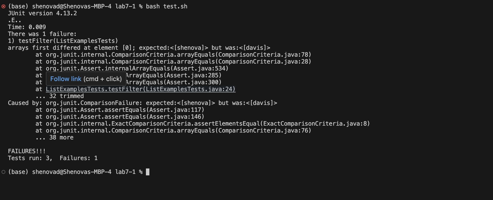
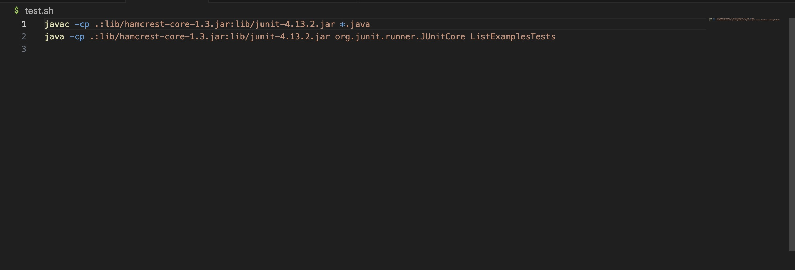
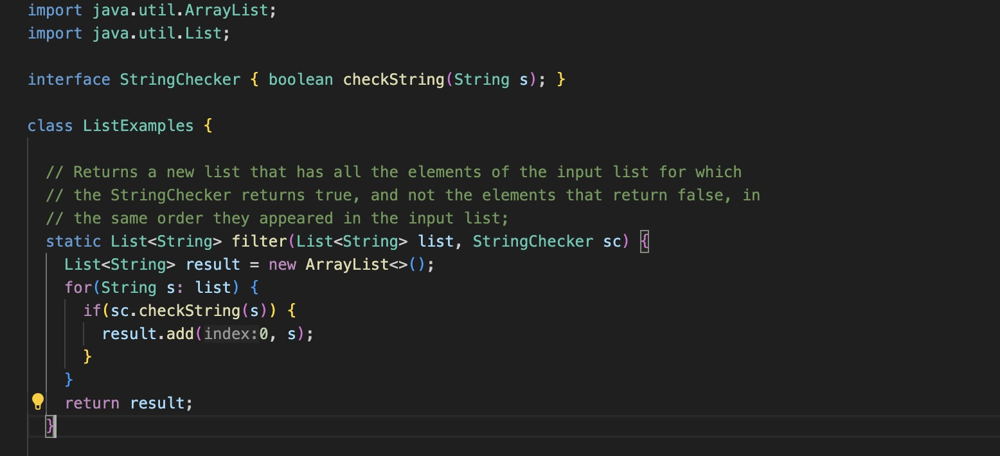
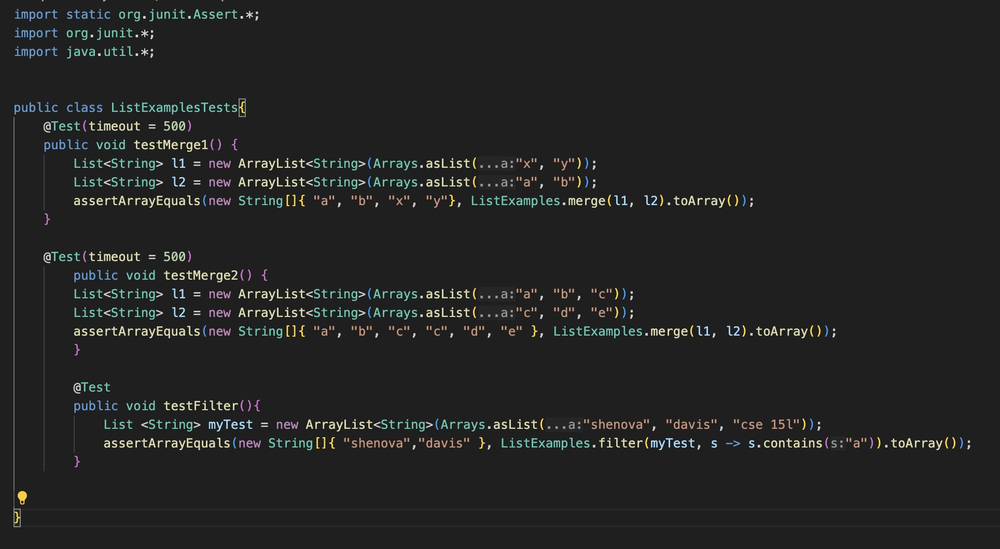
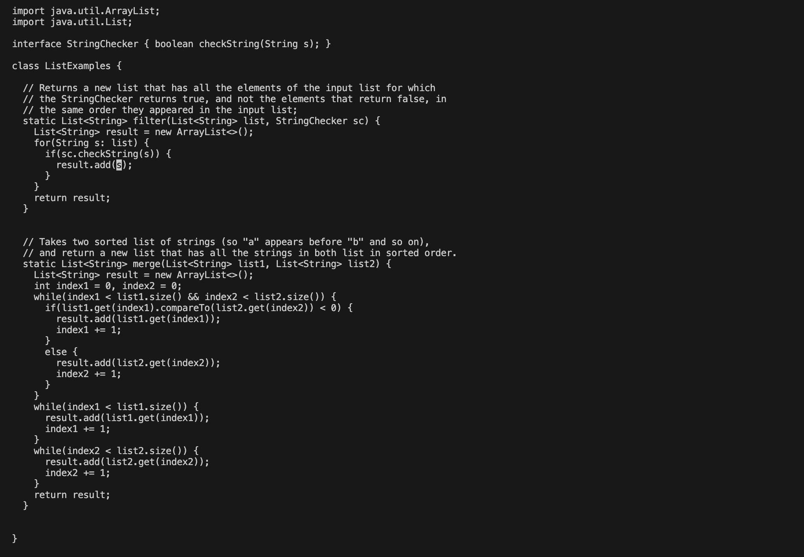
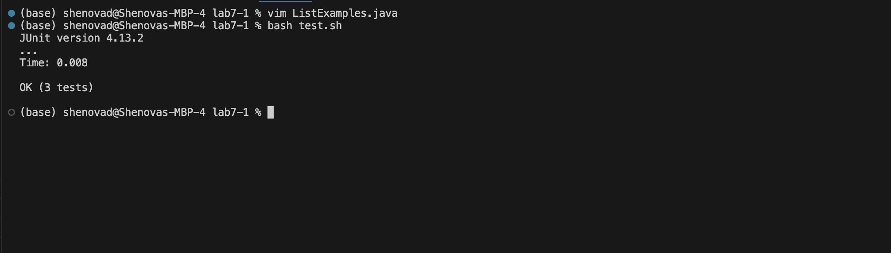

# Lab Report 5

Shenova Davis  
CSE 15L

## Part 1 

### Student EdStem Submission 

Hello! I am currently working on my file for `test.sh` to test the methods in `ListExamples.java`. I am getting this error with my tester file and am not sure where the issue lies. I believe it is in my `filter` method, but I don't see where the issue is. Could someone assist?

Symptom: 
 

Script for `test.sh`:
 

`ListExamples.java`: 
 

`ListExamplesTests.java`:
 

### TA Response

Hello! Your issue seems to be with how the `filter` method is adding elements to the new array. I would advise you to check your method and look carefully at what it is doing to add elements to the array. 

### Student using TA guidance

I checked my `filter` method and found that the `.add` method was adding the elements to the beginning of the array instead of to the end to maintain the structure. I used Vim to edit the file and now the tests pass, as seen below. 

Making changes in the file and test working:
 
 

### SetUp Necessities

1. The file & directory structure needed
```
- lab 7-1
   - lib
      - hamcrest-core-1.3.jar
      - junit-4.13.2.jar
   - ListExamples.class
   - ListExamples.java
   - ListExamplesTest.class
   - ListExamplesTest.java
   - StringChecker.class
   - test.sh
```

2. The contents of each file before fixing the bug

`ListExamples.java`
 
`ListExamplesTests.java`

`test.sh`
 

3. The full command line (or lines) you ran to trigger the bug
   
 

4. A description of what to edit to fix the bug
   - I needed to fix the code at line 15 where `result.add(0,s)` should be `result.add(s)` so that the elements are added to the end of the list and the ordering of the list is preserved.
 

## Part 2

In the second half of the quarter, I am happy that I learned how to use several tools and commands such as Vim. I had always heard about VIm but had no idea what it was or how to use it. Now I am able to use it on my own and make edits to my files directly from the command line. I also think learning about scripting has made coding much easier for me. I use a `.sh` file to run testers for my PAs in CSE 12, and it makes completing them and running testers so much quicker. 
